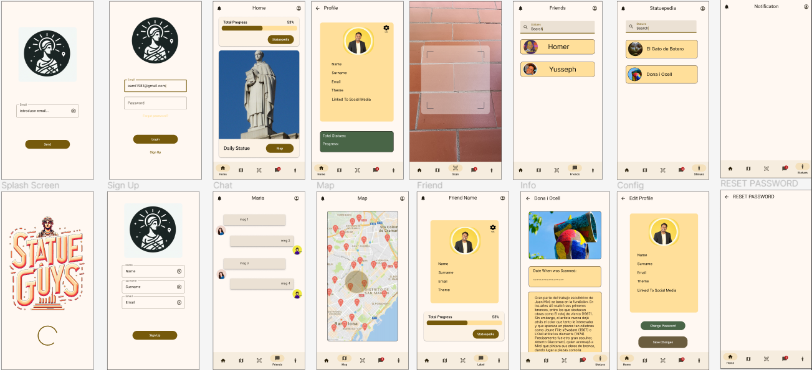
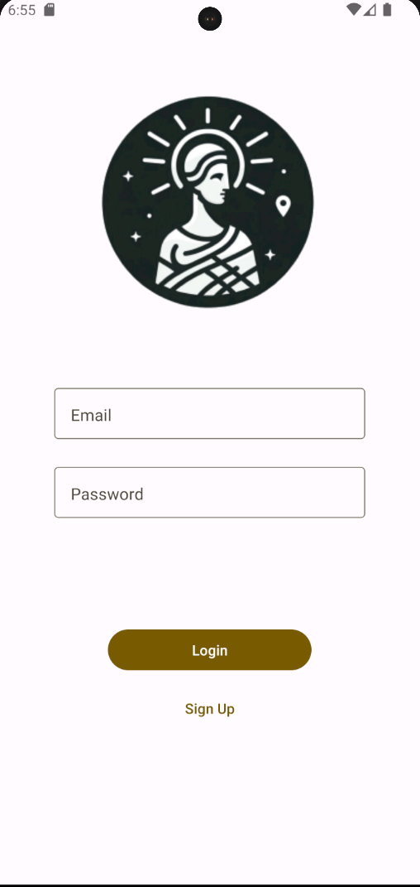
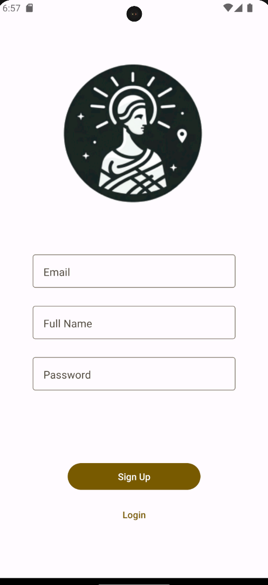
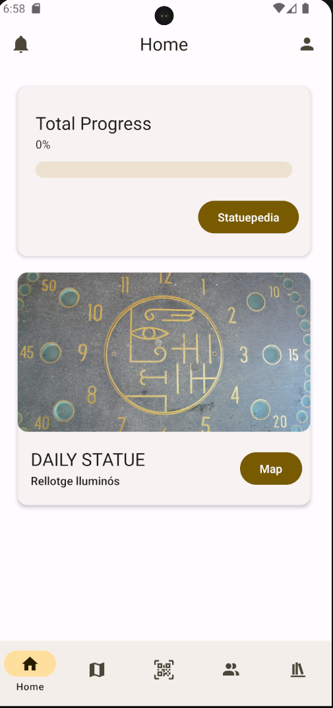
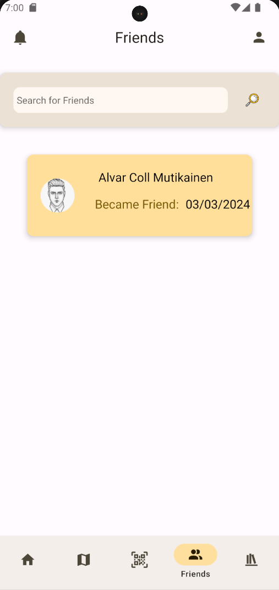
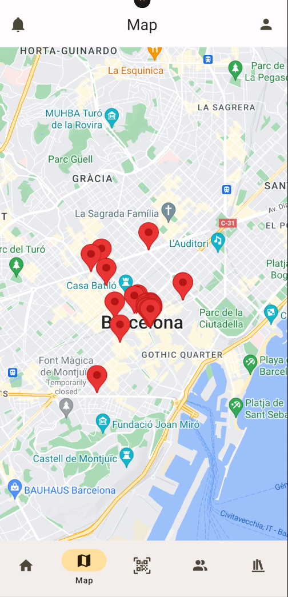
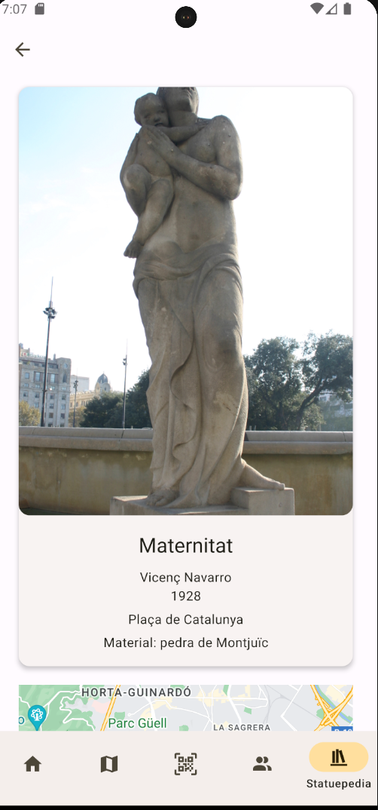

# Documentación Follow

## Descripción General

Follow es una aplicación móvil de redes sociales que permite a los usuarios explorar y compartir información sobre las estatuas de Barcelona escaneando códigos QR. Los usuarios pueden escanear códigos QR en las estatuas, agregarlas a su perfil, ver fotos e historias asociadas, conectarse con otros usuarios y chatear con ellos.

La aplicación está desarrollada utilizando React Native y Expo para la creación de la interfaz de usuario móvil. La lógica del backend se implementa en Spring Boot, con Hibernate para el mapeo objeto-relacional y una base de datos JDBC para el almacenamiento de datos.

## Configuración del Entorno de Desarrollo

La configuración del entorno de desarrollo para la aplicación Follow incluye:

{width=200} {width=200} {width=200}

- **React Native y Expo**: Utilizados para el desarrollo de la interfaz de usuario móvil.
- **Spring Boot**: Framework utilizado para el desarrollo del backend de la API.
- **Hibernate**: Framework de mapeo objeto-relacional (ORM) para el manejo de la persistencia de datos.
- **Base de datos JDBC**: Utilizada para almacenar datos relacionados con las estatuas, usuarios y conexiones entre ellos.

## Dependencias Utilizadas

### Backend (Spring Boot)

- **Spring Boot**: Framework principal para el desarrollo rápido de aplicaciones en Java.
- **Hibernate**: Framework de mapeo objeto-relacional (ORM) para el manejo de la persistencia de datos.
- **MySQL Connector/J**: Dependencia para conectar la aplicación Spring Boot con la base de datos MySQL.
- **Spring Web**: Utilizado para crear endpoints RESTful en la API.

### Frontend (React Native)

- **Expo**: Plataforma y conjunto de herramientas para el desarrollo de aplicaciones móviles con React Native.
- **React Navigation**: Utilizado para la navegación entre pantallas en la aplicación.
- **React Native Elements**: Librería de componentes UI personalizables para React Native.
- **React Native Maps**: Componente para integrar mapas en la aplicación.

## Diseño de la Aplicación

Para el diseño de la aplicación, utilizamos Figma como herramienta de diseño de interfaz de usuario. Siempre seguimos un modelo predefinido en Figma y escogimos colores acordes a lo que queríamos transmitir con la aplicación. Los colores principales utilizados son:

- **#FFF8F2**
- **#4D4639**
- **#765A0B**
- **#FFFFFF**

Estamos todos muy contentos con el resultado final de la app, ya que hemos conseguido plasmar correctamente el diseño de Figma en la aplicación.

## Pantallas de la Aplicación

### Pantalla de Inicio de Sesión

La pantalla de **Inicio de Sesión** permite a los usuarios iniciar sesión en la aplicación.

{width=300}

#### Funcionalidades:

- **Inicio de Sesión**: Los usuarios pueden ingresar su correo electrónico y contraseña para iniciar sesión en la aplicación.
- **Registro**: Si los usuarios aún no tienen una cuenta, pueden hacer clic en el botón "Sign Up" para registrarse.
- **Autenticación**: La pantalla valida los datos ingresados antes de enviar la solicitud al servidor.

##### Endpoints:

- **Inicio de Sesión**: Utiliza el endpoint `/api/auth/login` para autenticar las credenciales del usuario y obtener un token de acceso.

### Pantalla de Registro

La pantalla de **Registro** permite a los usuarios crear una nueva cuenta en la aplicación.

{width=300}

#### Funcionalidades:

- **Registro de Usuario**: Los usuarios pueden completar el formulario con su nombre, correo electrónico y contraseña para crear una nueva cuenta.
- **Inicio de Sesión**: Si los usuarios ya tienen una cuenta, pueden hacer clic en el botón "Login" para ir a la pantalla de inicio de sesión.

##### Endpoints:

- **Registro de Usuario**: Utiliza el endpoint `/api/auth/signup` para crear una nueva cuenta de usuario en la aplicación.

### Pantalla de Inicio

La pantalla de **Inicio** es la página principal de la aplicación, donde los usuarios pueden ver su progreso total y la estatua diaria destacada.

{width=300}

#### Funcionalidades:

- **Progreso Total**: Muestra el progreso total del usuario en forma de una barra de progreso. El usuario puede ver el porcentaje de progreso alcanzado hasta el momento y hacer clic en el botón "Statuepedia" para explorar más estatuas.
- **Estatua Diaria Destacada**: Muestra la estatua destacada del día con su imagen y título. Los usuarios pueden hacer clic en el botón "Map" para ver la ubicación de esta estatua en el mapa.

##### Endpoints:

- **Progreso Total**: La aplicación utiliza el endpoint `/api/users/getProgress/{userId}` para obtener el progreso total del usuario.
- **Estatua Diaria Destacada**: Utiliza el endpoint `/api/statue/{id}` para obtener la información de la estatua diaria destacada.

### Pantalla de Lista de Amigos

La pantalla de **Lista de Amigos** permite a los usuarios ver su lista de amigos y buscar nuevos amigos.

{width=300}

#### Funcionalidades:

- **Búsqueda de Amigos**: Los usuarios pueden buscar nuevos amigos ingresando el nombre en el campo de búsqueda.
- **Envío de Solicitudes de Amistad**: Los usuarios pueden enviar solicitudes de amistad a otros usuarios desde la lista de resultados de búsqueda.
- **Visualización de Amigos**: Los usuarios pueden ver la lista de sus amigos y hacer clic en ellos para ver más detalles.

##### Endpoints:

- **Búsqueda de Amigos**: Utiliza el endpoint `/api/search-friends` para buscar amigos por nombre.
- **Envío de Solicitudes de Amistad**: Utiliza el endpoint `/api/send-friend-request` para enviar una solicitud de amistad a otro usuario.
- **Visualización de Amigos**: Utiliza el endpoint `/api/get-friends` para obtener la lista de amigos de un usuario.

### Pantalla de Mapa

La pantalla de **Mapa** muestra una vista del mapa con marcadores que representan las ubicaciones de las estatuas.

{width=300}

#### Funcionalidades:

- **Visualización de Ubicaciones**: Muestra marcadores en el mapa que representan las ubicaciones de las estatuas.
- **Interacción con Marcadores**: Los usuarios pueden tocar los marcadores para ver más detalles sobre cada estatua.

##### Endpoints:

- **Obtener Todas las Estatuas**: Utiliza el endpoint `/api/statues` para obtener información sobre todas las estatuas disponibles.

### Pantalla de Información de Estatua

La pantalla de **Información de Estatua** muestra detalles sobre una estatua específica, incluyendo su imagen, título, autor, fecha, ubicación, descripción y material.

{width=300}

#### Funcionalidades:

- **Visualización de Detalles**: Muestra detalles como el título, autor, fecha, ubicación, descripción y material de la estatua.
- **Imagen de la Estatua**: Muestra la imagen de la estatua, si está disponible.
- **Ubicación en el Mapa**: Muestra la ubicación de la estatua en un mapa con un marcador.

##### Endpoints:

- **Obtener Detalles de Estatua**: Utiliza el endpoint `/api/statue/{id}` para obtener información detallada sobre una estatua específica.

## Endpoints

### Usuarios

1. **Obtener Perfil de Usuario**
   - **Método:** `GET`
   - **URL:** `/api/profile/{id}`
   - **Descripción:** Obtiene el perfil de un usuario por su ID.

2. **Actualizar Perfil de Usuario**
   - **Método:** `PUT`
   - **URL:** `/api/profile/{id}`
   - **Descripción:** Actualiza el perfil de un usuario.

3. **Subir Foto de Perfil**
   - **Método:** `POST`
   - **URL:** `/api/profile-picture/{id}`
   - **Descripción:** Sube una foto de perfil para un usuario.

4. **Obtener Progreso del Usuario**
   - **Método:** `GET`
   - **URL:** `/api/progress/{id}`
   - **Descripción:** Obtiene el progreso de un usuario por su ID.

5. **Obtener Estatuas Diarias**
   - **Método:** `GET`
   - **URL:** `/api/daily`
   - **Descripción:** Obtiene las estatuas diarias disponibles.

6. **Añadir Estatua a Usuario**
   - **Método:** `POST`
   - **URL:** `/api/addStatue`
   - **Descripción:** Añade una estatua al perfil de un usuario.

7. **Actualizar Tema de Usuario**
   - **Método:** `PUT`
   - **URL:** `/api/updateTheme`
   - **Descripción:** Actualiza el tema preferido de un usuario.

8. **Actualizar Nombre de Usuario**
   - **Método:** `PUT`
   - **URL:** `/api/updateName`
   - **Descripción:** Actualiza el nombre de un usuario.

9. **Actualizar Correo Electrónico de Usuario**
   - **Método:** `PUT`
   - **URL:** `/api/updateEmail`
   - **Descripción:** Actualiza el correo electrónico de un usuario.

10. **Eliminar Perfil de Usuario**
    - **Método:** `DELETE`
    - **URL:** `/api/profile/{id}`
    - **Descripción:** Elimina el perfil de un usuario por su ID.

### Estatuas

1. **Obtener Todas las Estatuas**
   - **Método:** `GET`
   - **URL:** `/api/statues`
   - **Descripción:** Obtiene todas las estatuas disponibles.

2. **Obtener Estatua por ID**
   - **Método:** `GET`
   - **URL:** `/api/statue/{id}`
   - **Descripción:** Obtiene una estatua por su ID.

3. **Crear Estatua**
   - **Método:** `POST`
   - **URL:** `/api/statue`
   - **Descripción:** Crea una nueva estatua.

4. **Crear Múltiples Estatuas**
   - **Método:** `POST`
   - **URL:** `/api/statues`
   - **Descripción:** Crea múltiples estatuas simultáneamente.

5. **Actualizar Estatua**
   - **Método:** `PUT`
   - **URL:** `/api/statue/{id}`
   - **Descripción:** Actualiza una estatua existente por su ID.

6. **Eliminar Estatua**
   - **Método:** `DELETE`
   - **URL:** `/api/statue/{id}`
   - **Descripción:** Elimina una estatua por su ID.

7. **Contar Estatuas**
   - **Método:** `GET`
   - **URL:** `/api/count-statues`
   - **Descripción:** Cuenta el número total de estatuas disponibles.

### Amigos

1. **Obtener Solicitudes de Amistad**
   - **Método:** `GET`
   - **URL:** `/api/friend-requests/{id}`
   - **Descripción:** Obtiene las solicitudes de amistad para un usuario por su ID.

2. **Eliminar Solicitud de Amistad**
   - **Método:** `DELETE`
   - **URL:** `/api/friend-request/{id}`
   - **Descripción:** Elimina una solicitud de amistad por su ID.

3. **Obtener Amigos por ID de Usuario**
   - **Método:** `GET`
   - **URL:** `/api/friends/{id}`
   - **Descripción:** Obtiene la lista de amigos de un usuario por su ID.

4. **Obtener Progreso de Amigos**
   - **Método:** `GET`
   - **URL:** `/api/friends-progress/{id}`
   - **Descripción:** Obtiene el progreso de las estatuas encontradas por los amigos de un usuario por su ID.

5. **Enviar Solicitud de Amistad**
   - **Método:** `POST`
   - **URL:** `/api/send-request`
   - **Descripción:** Envía una solicitud de amistad.

6. **Aceptar Solicitud de Amistad**
   - **Método:** `POST`
   - **URL:** `/api/accept-request`
   - **Descripción:** Acepta una solicitud de amistad.

### Mensajes

1. **Obtener Mensaje entre Remitente y Destinatario**
   - **Método:** `GET`
   - **URL:** `/api/message`
   - **Descripción:** Obtiene los mensajes entre un remitente y un destinatario especificados.

2. **Enviar Mensaje**
   - **Método:** `POST`
   - **URL:** `/api/message`
   - **Descripción:** Envía un mensaje entre usuarios.

3. **Eliminar Mensaje**
   - **Método:** `DELETE`
   - **URL:** `/api/message`
   - **Descripción:** Elimina un mensaje especificado por su ID de usuario y ID de mensaje.

4. **Actualizar Mensaje**
   - **Método:** `PUT`
   - **URL:** `/api/message`
   - **Descripción:** Actualiza un mensaje especificado por su ID de usuario y ID de mensaje.
